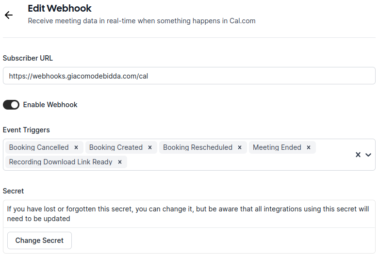

# webhooks 🪝

My collection of webhook targets for several services: [Cal.com](https://cal.com/docs/core-features/webhooks), [Cloud Monitoring](https://cloud.google.com/monitoring/support/notification-options#webhooks), [npm.js](https://docs.npmjs.com/cli/v7/commands/npm-hook), [Stripe](https://stripe.com/docs/webhooks), etc.

All webhooks targets are hosted on the same Cloudflare Pages website. Some routes are handled by Cloudflare Pages [Functions routing](https://developers.cloudflare.com/pages/platform/functions/routing/). Some other routes are handled by [Hono](https://hono.dev/api/routing).

| service | routing |
| :--- | :--- |
| `cal` | Hono |
| `cloudinary` | Hono |
| `monitoring` | Hono |
| `npm` | Pages Functions |
| `stripe` | Hono |
| `webpagetest` | Pages Functions |

## Installation

This project requires a recent version of Node.js, ngrok and wrangler.

If you use the [nix package manager](https://nixos.org/), you don't have to worry about installing them, since they are specified in the `flake.nix` file and will be installed automatically when you enter the project root directory. Otherwise you'll have to install them manually.

You then have to install the npm packages:

```sh
npm install
```

The project also requires a few environment variables and secrets to be set (see below).

## Development

When developing this Cloudflare Pages Function project, you will need to create a [.dev.vars](https://developers.cloudflare.com/workers/configuration/secrets/#secrets-in-development) file in the repository root. This file should **not** be tracked in version control since it contains environment variables and secrets that will be used when running `wrangler pages dev`.

You can generate the `.dev.vars` file using this script:

```sh
node scripts/make-dev-vars.mjs
```

When developing handlers for [Stripe webhooks](https://stripe.com/docs/webhooks), you will need 2 terminals open to develop this application. In all other cases you will need 3 terminals open. I use [Tmux](https://github.com/tmux/tmux/wiki) for this.

### Environment variables & secrets

When developing an app for Cloudflare Workers or Cloudflare Pages with `wrangler dev`, you can set environment variables and secrets in a `.dev.vars` file. This file must be kept in the root directory of your project. Given that some secrets might be JSON strings, I like to keep them the [secrets](./secrets/README.md) directory. Then I generate the `.dev.vars` file using this script:

```sh
node scripts/make-dev-vars.mjs
```

### Stripe webhooks

First of all, create a Stripe webhook endpoint for you Stripe account in **test** mode, and your Stripe account in **live** mode. Double check that you have created and enabled such endpoints:

```sh
stripe webhook_endpoints list --api-key $STRIPE_API_KEY_TEST
stripe webhook_endpoints list --api-key $STRIPE_API_KEY_LIVE
```

In the **first terminal** run the following command, which watches all files using [wrangler](https://github.com/cloudflare/workers-sdk) and forwards all Stripe webhook events to `localhost:8788` using the [Stripe CLI](https://github.com/stripe/stripe-cli):

```sh
npm run dev
```

The main web page will be available at: http://localhost:8788/

In the **second terminal**, [trigger](https://stripe.com/docs/cli/trigger) some Stripe events:

```sh
stripe trigger customer.created
stripe trigger payment_intent.succeeded
stripe trigger price.created
stripe trigger product.created

API_KEY=$(cat secrets/stripe-webhook-endpoint-live.json | jq '.api_key') && \
SIGNING_SECRET=$(cat secrets/stripe-webhook-endpoint-live.json | jq '.signing_secret') &&
echo "API key is ${API_KEY} and secret is ${SIGNING_SECRET}"

stripe trigger --api-key $STRIPE_API_KEY_RESTRICTED customer.created
```

Or make some POST requests manually:

POST to the test endpoint without required header and invalid data:

```sh
curl "$WEBHOOKS_TARGET/stripe" \
  -X POST \
  -H "Content-Type: application/json" \
  -d '{"foo": "bar", "baz": 123}' | jq
```

POST to the test endpoint with the required header but invalid data:

```sh
curl "$WEBHOOKS_TARGET/stripe" \
  -X POST \
  -H "Content-Type: application/json" \
  -H "stripe-signature: foobar" \
  -d '{"foo": "bar", "baz": 123}' | jq
```

POST to the test endpoint with the required header and valid data:

```sh
curl "$WEBHOOKS_TARGET/stripe" \
  -X POST \
  -H "Content-Type: application/json" \
  -H "stripe-signature: foobar" \
  -d "@./assets/webhook-events/stripe/customer-created.json" | jq
```

POST to the live endpoint with invalid data:

```sh
STRIPE_WEBHOOKS_ENDPOINT=$(
  cat secrets/stripe-webhook-endpoint-live.json | jq '.url' | tr -d '"'
) && \
curl $STRIPE_WEBHOOKS_ENDPOINT \
  -X POST \
  -H "Content-Type: application/json" \
  -d '{
    "foo": "bar",
    "baz": 123
  }' | jq
```

Also, send a GET request to see list of all events that Stripe is allowed to send to this endpoint:

```sh
curl "$WEBHOOKS_TARGET/stripe" \
  -X GET \
  -H "Content-Type: application/json" | jq
```

### Instructions for all webhooks except the ones from Stripe

In the **first terminal**, run this command to [develop the Pages application locally](https://developers.cloudflare.com/pages/functions/local-development/#run-your-pages-project-locally):

```sh
npm run dev:pages
```

The app will be available at: http://localhost:8788/

In the **second terminal**, run this command to create a HTTPS => HTTP tunnel with [ngrok](https://ngrok.com/) on port `8788`:

```sh
npm run tunnel
```

Now copy the public, **Forwarding URL** that ngrok gave you, and assign it to the `WEBHOOKS_TARGET` environment variable (for example, paste it in your `.envrc` file and reload it with `direnv allow`). Be sure to **remove any trailing slashes**.


> :information_source: **Note:**
>
> Now you can also:
>
> - visit http://localhost:4040/status to know the public URL ngrok assigned you.
> - visit http://localhost:4040/inspect/http to inspect/replay past requests that were tunneled by ngrok.

In the **third terminal**, make some POST requests simulating webhook events sent by a third-party service. See a few examples below.

### cal.com webhooks

See the [documentation on cal.com](https://cal.com/docs/core-features/webhooks).



```sh
curl "$WEBHOOKS_TARGET/cal" \
  -X POST \
  -H "Content-Type: application/json" \
  -d '{"foo": 123, "bar": 456}' | jq
```

```sh
curl "$WEBHOOKS_TARGET/cal" \
  -X POST \
  -H "Content-Type: application/json" \
  -H "X-Cal-Signature-256: hex-string-sent-by-cal.com" \
  -d '{"foo": 123, "bar": 456}' | jq
```

```sh
curl "$WEBHOOKS_TARGET/cal" \
  -X POST \
  -H "Content-Type: application/json" \
  -H "X-Cal-Signature-256: hex-string-sent-by-cal.com" \
  -d "@./assets/webhook-events/cal/booking-created.json" | jq
```

Create a new booking:

```sh
curl "$WEBHOOKS_TARGET/cal" \
  -X POST \
  -H "Content-Type: application/json" \
  -H "X-Cal-Signature-256: hex-string-sent-by-cal.com" \
  -d "@./assets/webhook-events/cal/booking-created.json" | jq
```

Reschedule a booking:

```sh
curl "$WEBHOOKS_TARGET/cal" \
  -X POST \
  -H "Content-Type: application/json" \
  -H "X-Cal-Signature-256: hex-string-sent-by-cal.com" \
  -d "@./assets/webhook-events/cal/booking-rescheduled.json" | jq
```

Cancel a booking:

```sh
curl "$WEBHOOKS_TARGET/cal" \
  -X POST \
  -H "Content-Type: application/json" \
  -H "X-Cal-Signature-256: hex-string-sent-by-cal.com" \
  -d "@./assets/webhook-events/cal/booking-cancelled.json" | jq
```

Event sent by cal.com when a meeting ends:

```sh
curl "$WEBHOOKS_TARGET/cal" \
  -X POST \
  -H "Content-Type: application/json" \
  -H "X-Cal-Signature-256: hex-string-sent-by-cal.com" \
  -d "@./assets/webhook-events/cal/meeting-ended.json" | jq
```

### Cloudinary webhooks

See the [documentation on Cloudinary](https://cloudinary.com/documentation/notifications).

Missing headers, invalid data:

```sh
curl "$WEBHOOKS_TARGET/cloudinary" \
  -X POST \
  -H "Content-Type: application/json" \
  -d '{"foo": 123, "bar": 456}' | jq
```

Required headers, invalid data:

```sh
curl "$WEBHOOKS_TARGET/cloudinary" \
  -X POST \
  -H "Content-Type: application/json" \
  -H "X-Cld-Signature: signature-sent-by-cloudinary" \
  -H "X-Cld-Timestamp: 1685819601" \
  -d '{"foo": 123, "bar": 456}' | jq
```

Required headers, valid data:

```sh
curl "$WEBHOOKS_TARGET/cloudinary" \
  -X POST \
  -H "Content-Type: application/json" \
  -H "X-Cld-Signature: signature-sent-by-cloudinary" \
  -H "X-Cld-Timestamp: 1685819601" \
  -d "@./assets/webhook-events/cloudinary/image-uploaded.json" | jq
```

```sh
curl "$WEBHOOKS_TARGET/cloudinary" \
  -X POST \
  -H "Content-Type: application/json" \
  -H "X-Cld-Signature: signature-sent-by-cloudinary" \
  -H "X-Cld-Timestamp: 1685819601" \
  -d "@./assets/webhook-events/cloudinary/image-uploaded.json" | jq
```

### Cloud Monitoring webhooks

See the [documentation on Cloud Monitoring](https://cloud.google.com/monitoring/support/notification-options#webhooks).

Missing headers, invalid data:

A [Cloud Monitoring webhook notification channel](https://cloud.google.com/monitoring/support/notification-options#webhooks) supports basic access authentication.

Cloud Monitoring requires your server to return a 401 response with the proper [WWW-Authenticate header](https://developer.mozilla.org/en-US/docs/Web/HTTP/Headers/WWW-Authenticate). So we use `curl --include` or `curl --verbose` to verify that the server returns the `WWW-Authenticate` response header.

```sh
curl "$WEBHOOKS_TARGET/monitoring" \
  -X POST \
  -H "Content-Type: application/json" \
  -d '{"foo": 123, "bar": 456}' --include
```

Required headers, invalid data:

```sh
curl "$WEBHOOKS_TARGET/monitoring" \
  -X POST \
  -H "Content-Type: application/json" \
  -H "Authorization: Basic $BASE64_ENCODED_BASIC_AUTH" \
  -d '{"foo": 123, "bar": 456}' | jq
```

Required headers, valid data:

```sh
curl "$WEBHOOKS_TARGET/monitoring" \
  -X POST \
  -H "Content-Type: application/json" \
  -H "Authorization: Basic $BASE64_ENCODED_BASIC_AUTH" \
  -d "@./assets/webhook-events/cloud-monitoring/incident-created.json" | jq
```

Required headers, valid data:

```sh
curl "$WEBHOOKS_TARGET/monitoring" \
  -X POST \
  -H "Content-Type: application/json" \
  -H "Authorization: Basic $BASE64_ENCODED_BASIC_AUTH" \
  -d "@./assets/webhook-events/cloud-monitoring/incident-created.json" | jq
```

### npm.js webhooks

See the [documentation on npm.js](https://docs.npmjs.com/cli/v9/commands/npm-hook).

On NixOS, `~/.npmrc` is a symbolic link to a filepath in the Nix store, which is a read-only filesystem. To authenticate with the npm CLI we have to use a local `.npmrc`. Create an empty `.npmrc` in the project root, then obtain the authentication token from npm.js by running the following command:

```sh
npm adduser --userconfig .npmrc
```

Now all npm commands that require authentication should work fine:

```sh
npm whoami
npm hook ls
```

Add a few npm hooks.

```sh
# npm scope
npm hook add '@thi.ng' "$WEBHOOKS_TARGET/npm" $NPM_WEBHOOK_SECRET --userconfig .npmrc
# npm username
npm hook add '~jackdbd' "$WEBHOOKS_TARGET/npm" $NPM_WEBHOOK_SECRET
# npm package
npm hook add @11ty/eleventy "$WEBHOOKS_TARGET/npm" $NPM_WEBHOOK_SECRET
```

```sh
curl "$WEBHOOKS_TARGET/npm" \
  -X POST \
  -H "Content-Type: application/json" \
  -d '{"foo": 123, "bar": 456}' | jq
```

```sh
curl "$WEBHOOKS_TARGET/npm" \
  -X POST \
  -H "Content-Type: application/json" \
  -H "x-npm-signature: $NPM_WEBHOOK_SECRET" \
  -d "@./assets/webhook-events/npm/package-changed.json" | jq
```

### WebPageTest pingbacks

See the [documentation on WebPageTest](https://docs.webpagetest.org/integrations/).

```sh
curl "$WEBHOOKS_TARGET/webpagetest?id=some-webpagetest-test-id" \
  -X GET \
  -H "Content-Type: application/json"
```

## Troubleshooting webhooks

Access your Cloudflare Pages Functions logs by using the Cloudflare dashboard or the Wrangler CLI:

```sh
npm run logs
```

[See the docs](https://developers.cloudflare.com/pages/platform/functions/debugging-and-logging/) for details.

## Deploy

I enabled automatic deployments, so the application is automatically deployed to Cloudflare Pages on each `git push` (`main` is the production branch, all other branches are `preview` branches).

You can also deploy manually using this command:

```sh
npm run deploy
```
