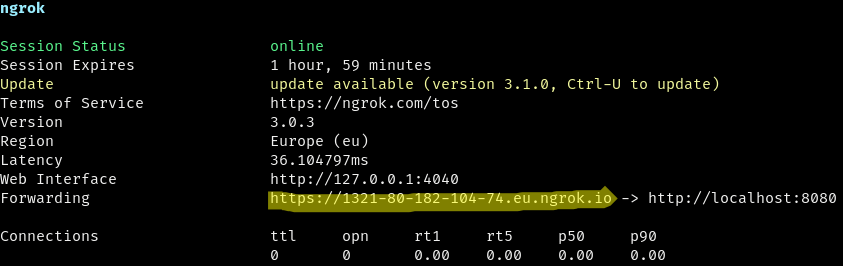

# webhooks 🪝

Application that I use to process webhook events fired by several services: [Cloud Monitoring](https://cloud.google.com/monitoring/support/notification-options#webhooks), [npm.js](https://docs.npmjs.com/cli/v7/commands/npm-hook), [Stripe](https://stripe.com/docs/webhooks), etc. All webhooks are hosted as a single application on Cloudflare Pages. Some routes are handled by the [Cloudflare Pages Functions routing](https://developers.cloudflare.com/pages/platform/functions/routing/). Some others are handled by [Hono](https://hono.dev/).

> :warning: **Warning:**
>
> Don't use wrangler 3 until [this bug](https://github.com/cloudflare/workers-sdk/issues/3262) is fixed.

## Installation

```sh
npm install
```

## Development

When developing handlers for [Stripe webhooks](https://stripe.com/docs/webhooks), you will need 2 terminals open to develop this application. In all other cases you will need 3 terminals open. I use [Tmux](https://github.com/tmux/tmux/wiki) for this.

### Environment variables & secrets

When developing an app for Cloudflare Workers or Cloudflare Pages with `wrangler dev`, you can set environment variables and secrets in a `.dev.vars` file. This file must be kept in the root directory of your project. Given that some secrets might be JSON strings, I like to keep them the [secrets](./secrets/README.md) directory. Then I generate the `.dev.vars` file using this script:

```sh
node scripts/make-dev-vars.mjs
# in alternative, run this npm script:
npm run make-dev-vars
```

### Stripe webhooks

In the **first terminal**, run this command, which watches all files using [wrangler](https://github.com/cloudflare/workers-sdk) and forwards all Stripe webhook events to `localhost:8788` using the [Stripe CLI](https://github.com/stripe/stripe-cli):

```sh
npm run dev
```

The main web page will be available at: http://localhost:8788/

In the **second terminal**, [trigger](https://stripe.com/docs/cli/trigger) some Stripe events:

```sh
stripe trigger --api-key $STRIPE_API_KEY_TEST customer.created
stripe trigger --api-key $STRIPE_API_KEY_TEST payment_intent.succeeded
stripe trigger --api-key $STRIPE_API_KEY_TEST price.created
stripe trigger --api-key $STRIPE_API_KEY_TEST product.created
```

### Instructions for all webhooks except the ones from Stripe

In the **first terminal**, run this command:

```sh
npm run dev
```

The main web page will be available at: http://localhost:8788/

In the **second terminal**, run this command, which create a HTTPS => HTTP tunnel with [ngrok](https://ngrok.com/) on port `8788`:

```sh
ngrok http 8788
```

Now copy the public, **Forwarding URL** that ngrok gave you, and assign it to the `WEBHOOKS_URL` environment variable (for example, paste it in your `.envrc` file and reload it with `direnv allow`). Be sure not to include any trailing slashes.



> :information_source: **Note:**
>
> Now you can also:
> - visit http://localhost:4040/status to know the public URL ngrok assigned you.
> - visit http://localhost:4040/inspect/http to inspect/replay past requests that were tunneled by ngrok.

In the **third terminal**, make some POST requests simulating webhook events sent by a third-party service. See a few examples below.

### cal.com webhooks

See the [documentation on cal.com](https://cal.com/docs/core-features/webhooks).

Create a new booking:

```sh
curl "$WEBHOOKS_URL/cal" \
  -X POST \
  -H "Content-Type: application/json" \
  -H "X-Cal-Signature-256: hex-string-sent-by-cal.com" \
  -d "@./assets/webhook-events/cal/booking-created.json"
```

Reschedule a booking:

```sh
curl "$WEBHOOKS_URL/cal" \
  -X POST \
  -H "Content-Type: application/json" \
  -H "X-Cal-Signature-256: hex-string-sent-by-cal.com" \
  -d "@./assets/webhook-events/cal/booking-rescheduled.json"
```

Cancel a booking:

```sh
curl "$WEBHOOKS_URL/cal" \
  -X POST \
  -H "Content-Type: application/json" \
  -H "X-Cal-Signature-256: hex-string-sent-by-cal.com" \
  -d "@./assets/webhook-events/cal/booking-cancelled.json"
```

Event sent by cal.com when a meeting ends:

```sh
curl "$WEBHOOKS_URL/cal" \
  -X POST \
  -H "Content-Type: application/json" \
  -H "X-Cal-Signature-256: hex-string-sent-by-cal.com" \
  -d "@./assets/webhook-events/cal/meeting-ended.json"
```

### Cloud Monitoring webhooks

See the [documentation on Cloud Monitoring](https://cloud.google.com/monitoring/support/notification-options#webhooks).

```sh
curl "$WEBHOOKS_URL/monitoring" \
  -X POST \
  -H "Content-Type: application/json" \
  -d "@./assets/webhook-events/cloud-monitoring/incident-created.json"
```

### npm.js webhooks

See the [documentation on npm.js](https://docs.npmjs.com/cli/v9/commands/npm-hook).

```sh
curl "$WEBHOOKS_URL/npm" \
  -X POST \
  -H "Content-Type: application/json" \
  -d "@./assets/webhook-events/npm/package-changed.json"
```

### WebPageTest pingbacks

See the [documentation on WebPageTest](https://docs.webpagetest.org/integrations/).

```sh
curl "$WEBHOOKS_URL/webpagetest?id=some-webpagetest-test-id"
```

## Troubleshooting webhooks

Access your Cloudflare Pages Functions logs by using the Cloudflare dashboard or the Wrangler CLI:

```sh
npm run logs
# which is equivalent to:
npx wrangler pages deployment tail --project-name webhooks
```

[See the docs](https://developers.cloudflare.com/pages/platform/functions/debugging-and-logging/) for details.

## Deploy

I enabled automatic deployments, so the application is automatically deployed to Cloudflare Pages on each `git push` (`main` is the production branch, all other branches are `preview` branches).

You can also deploy manually using this command:

```sh
npm run deploy
# which is equivalent to:
wrangler pages publish ./pages
```
